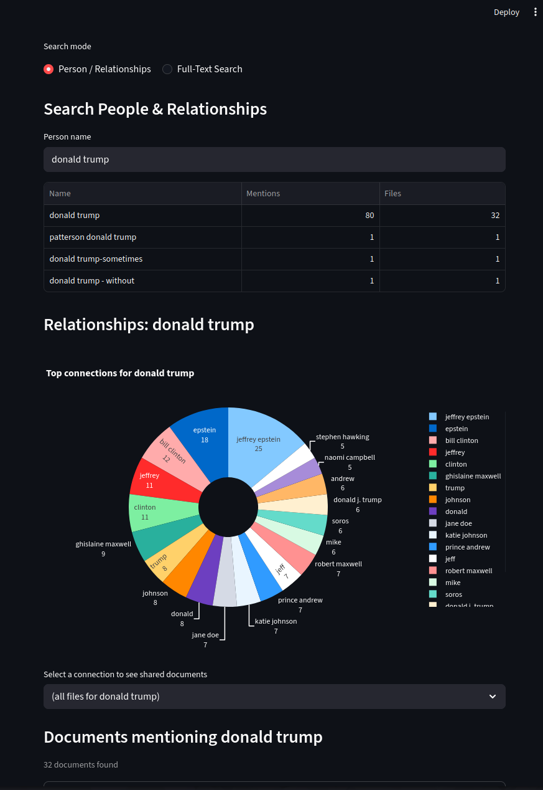
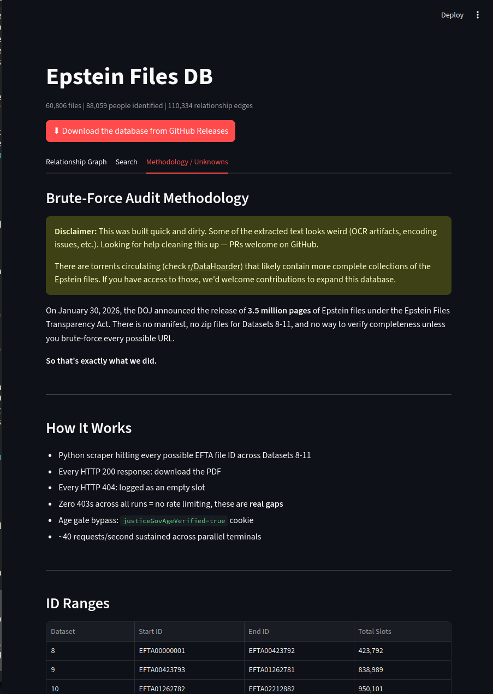

# Epstein Files DB

Interactive explorer for the DOJ's Epstein files release under the Epstein Files Transparency Act. Relationship graph, entity search, full-text search, and brute-force audit methodology across Datasets 8-11. This dataset is incomplete, but gross as is. Would love help filling it out.

## Quick Start

### 1. Clone the repo

```bash
git clone https://github.com/LMSBAND/epstein-files-db.git
cd epstein-files-db
```

### 2. Download the database

Download `epstein.db` (~835 MB) from [GitHub Releases](https://github.com/LMSBAND/epstein-files-db/releases/tag/v1.0) and place it at:

```
epstein_files/epstein.db
```

The release contains split gzip parts. To reassemble:

```bash
mkdir -p epstein_files
cd epstein_files
# Download all parts, then:
cat epstein.db.gz.part-* > epstein.db.gz
gunzip epstein.db.gz
cd ..
```

### 3. Install dependencies

```bash
pip install -r requirements.txt
```

### 4. Run

```bash
streamlit run app.py
```

Opens in your browser at `http://localhost:8501`.

## Screenshots





## Features

- **Relationship Graph** - Interactive network visualization of people co-occurring in documents. VIP nodes (Epstein, Maxwell, Trump, Clinton, Prince Andrew, etc.) highlighted.
- **Person Search** - Search by name, view connections, shared documents, and text snippets.
- **Full-Text Search** - Search across 146M+ characters of extracted text from all documents.
- **Methodology Tab** - Documents the brute-force audit of Datasets 8-11, including fill rates, 404 patterns, and open questions.

## Database Schema

| Table | Description |
|-------|-------------|
| `files` | All downloaded files with metadata (filename, dataset, path, size) |
| `entities` | NER-extracted entities (PERSON, ORG, etc.) per file |
| `entity_cooccurrence` | People who appear in the same documents, with shared file counts |
| `text_cache` | Extracted text from every file (~146M characters) |

## Requirements

- Python 3.10+
- ~1 GB RAM (database is queried locally via SQLite)
- ~900 MB disk for the database file

## License

Public domain data. Code is provided as-is for transparency and independent verification.
